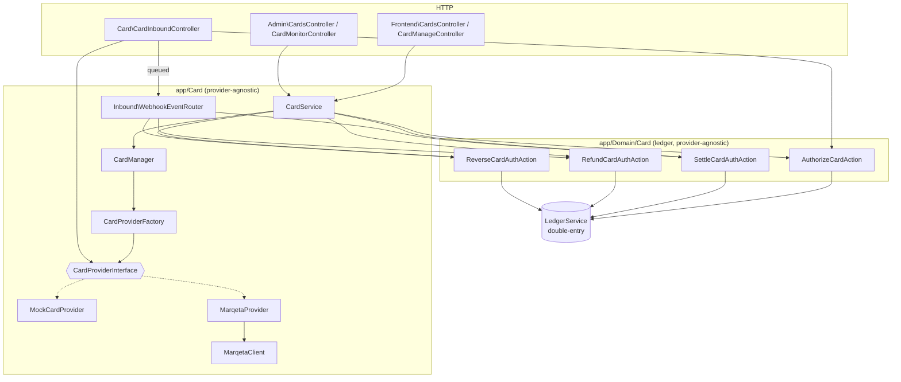

# Architecture

## Layering



**Rule:** HTTP/domain never reference a concrete provider. `CardService` is the
only facade controllers use. `Domain\Card` ledger actions know nothing about
providers — they move money in the double-entry ledger.

## Folder structure

```
app/Card/
  Contracts/CardProviderInterface.php     # the one contract
  DTOs/                                    # neutral cross-boundary shapes
    CardholderData.php  CardholderResult.php  CardIssueRequest.php  CardData.php
    SpendControlData.php  ProviderTransactionData.php
    NormalizedWebhookEvent.php  ProviderHealth.php
  Enums/ProviderCapability.php  Enums/WebhookEventType.php
  Exceptions/                              # CardProviderException + FeatureNotSupported + ProviderRequest + WebhookVerification
  Factory/CardProviderFactory.php          # driver key → adapter
  CardManager.php                          # resolve adapter for a card/provider
  CardService.php                          # facade (issue/freeze/terminate/controls/health)
  Support/ProviderLogger.php  Support/CardholderMapper.php
  Inbound/WebhookEventRouter.php           # canonical event → domain action
  Providers/
    AbstractCardProvider.php               # unsupported-by-default base
    Mock/MockCardProvider.php
    Marqeta/MarqetaProvider.php  Marqeta/MarqetaClient.php
    # Stripe/ Lithic/ Highnote/ …          # future adapters go here only

app/Domain/Card/    # UNCHANGED business logic: Authorize/Settle/Refund/Reverse/Close/Replace/…
app/Http/Controllers/Card/CardInboundController.php   # webhooks + JIT
app/Http/Controllers/Admin/CardMonitorController.php  # logs / webhooks / health
app/Jobs/ProcessCardWebhookJob.php
config/card.php
```

## Patterns

- **Adapter** — each provider adapts its API to `CardProviderInterface`.
- **Strategy / Factory** — `CardProviderFactory` selects the adapter by driver key.
- **Facade** — `CardService` is the single orchestration entry point.
- **Null-object-ish base** — `AbstractCardProvider` throws
  `FeatureNotSupportedException` for everything; adapters override only what they
  support and declare it via `capabilities()`.
- **DI** — everything constructor-injected; bound in `App\Providers\CardServiceProvider`.

## Provider selection (data-driven)

Each `card_providers` row has a `driver` column cast to the
`App\Card\Enums\CardProviderDriver` enum (`Mock` | `Marqeta` | …) — the enum value
matches the config key, and `CardProviderDriver::configured()` lists the drivers that
have an adapter in `config/card.php` (used for the admin dropdown + validation). A
card belongs to a provider; `CardManager::forCard($card)` resolves
`card.provider.driver` → adapter (factory accepts the enum or a string).
`config('card.default_provider')` is the fallback when a program pins none. This lets
**different programs run on different providers simultaneously**. Adding a driver =
add an enum case + a config entry + the adapter class.

## Service layer

| Class | Responsibility |
|-------|----------------|
| `CardService` | Facade: `issueCard`, `freeze`, `unfreeze`, `terminate`, `syncControls`, `capabilities`, `health`. Ensures the provider cardholder (`provider_accounts`), persists `Card` from `CardData`, degrades gracefully on `FeatureNotSupportedException`. |
| `CardManager` | Resolves the adapter for a driver key / `CardProvider` / `Card`. |
| `CardProviderFactory` | Builds + memoises adapters from `config/card.php`. Fails fast on unknown driver / missing adapter class. |
| `ProviderLogger` | Writes `card_provider_logs` with secrets redacted; **savepoint-wrapped** so a failed log insert never poisons the caller's DB transaction. |
| `WebhookEventRouter` | Maps a `NormalizedWebhookEvent` to `Settle`/`Refund`/`Reverse`/`Authorize` or a card-status mirror. Idempotent. |

`GenerateCardAction` now delegates to `CardService::issueCard`; the frontend/admin
freeze/close/replace/controls paths route through the provider (best-effort).

## DTOs (neutral boundary types)

| DTO | Direction | Notes |
|-----|-----------|-------|
| `CardholderData` / `CardholderResult` | in / out | maps our `User` ↔ provider cardholder token |
| `CardIssueRequest` | in | type, program, network, currency |
| `CardData` | out | `providerCardRef`, last4, expiry, status; `pan`/`cvv` populated **only** on reveal, never persisted |
| `SpendControlData` | in | limits, channel toggles, geo/MCC |
| `ProviderTransactionData` | out | normalized transaction row |
| `NormalizedWebhookEvent` | out | canonical event (`WebhookEventType`) + dedupe id |
| `ProviderHealth` | out | up/down + latency/message |

## Mock adapter

`MockCardProvider` implements the full surface with **no network calls**. Card data
is derived deterministically from the token (stable PAN/CVV on reveal); it **signs
its own** webhook/JIT bodies with an HMAC secret so the real verify → dedupe →
queue → process pipeline is exercised in tests. Declares every capability except
`SyncBalance` (JIT model → ledger is authoritative).

## Marqeta adapter

`MarqetaProvider` + `MarqetaClient` (Basic auth `application_token:admin_token`,
timeout/retries, every call logged). Mapping:

| Neutral op | Marqeta |
|------------|---------|
| createCardholder / update | `POST` / `PUT /users` |
| create*Card | `POST /cards` (uses `card_product_token`) |
| getCard (+reveal) | `GET /cards/{token}?show_pan&show_cvv_number` |
| freeze / unfreeze / terminate | `POST /cardtransitions` (SUSPENDED / ACTIVE / TERMINATED) |
| replace | terminate + reissue for same user/product |
| getTransactions | `GET /transactions?card_token=` |
| JIT funding | parse programgateway message → `CardAuthorizationRequest`; echo `jit_funding` (200) / decline (402) |
| webhooks | Basic-auth verify (+ optional HMAC-SHA256); map transactions/cardtransitions → canonical events |
| healthCheck | `GET /ping` |

`setSpendControls` and the `/simulate` payloads are **not** claimed as capabilities
yet (`TODO(marqeta)`): Marqeta enforces spend via velocity/auth controls + MCC
groups. Until mapped, `syncControls` degrades gracefully and local controls stay
authoritative.
