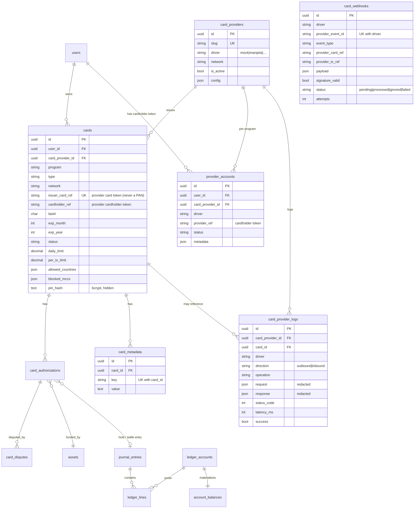

# Database

All card tables use UUID primary keys. Generic naming — no provider-specific
tables. Migrations: `..._create_card_tables`, `..._create_card_providers_table`,
`..._add_card_controls`, `2026_07_21_100000_create_card_provider_layer`,
`2026_07_21_100100_create_card_webhooks_table`.

## ERD

## Key constraints & indexes

| Table | Uniqueness / index | Why |
|-------|--------------------|-----|
| `cards` | unique `issuer_card_ref`; `ck_no_pan` CHECK | one provider token per card; **structurally forbids storing a raw PAN** |
| `card_authorizations` | unique `network_auth_id` | idempotent authorization (no double-hold) |
| `provider_accounts` | unique `(user_id, card_provider_id)`, `(driver, provider_ref)` | one cardholder per user per program |
| `card_webhooks` | unique `(driver, provider_event_id)` | **dedupe** — a replayed event is dropped |
| `card_provider_logs` | index `(driver, created_at)`, `card_id`, `operation` | fast admin filtering; immutable (no `updated_at`) |
| `journal_entries` | unique `idempotency_key` | ledger posting is idempotent (`card:hold:*`, `card:settle:*`, `card:refund:*`, `card:reverse:*`) |

## Idempotency (three layers)

1. **Authorization** — `card_authorizations.network_auth_id` unique; a re-sent auth returns the existing decision.
2. **Ledger** — `journal_entries.idempotency_key` unique; re-posting a hold/settle/refund/reverse is a no-op.
3. **Webhooks** — `card_webhooks (driver, provider_event_id)` unique; duplicate deliveries never reprocess.

## Ledger accounts used by cards

Cards move money through the existing double-entry ledger (`LedgerService`); no
balance lives at the provider (JIT model).

| Account type | Role |
|--------------|------|
| `user:available` | spendable balance |
| `user:card_hold` | authorized-but-unsettled hold |
| `card_program:settlement` | realized card spend (treasury) |
| `fee:card` | card fee income (bps of settlement) |
| `card_program:loss` | chargeback losses |
