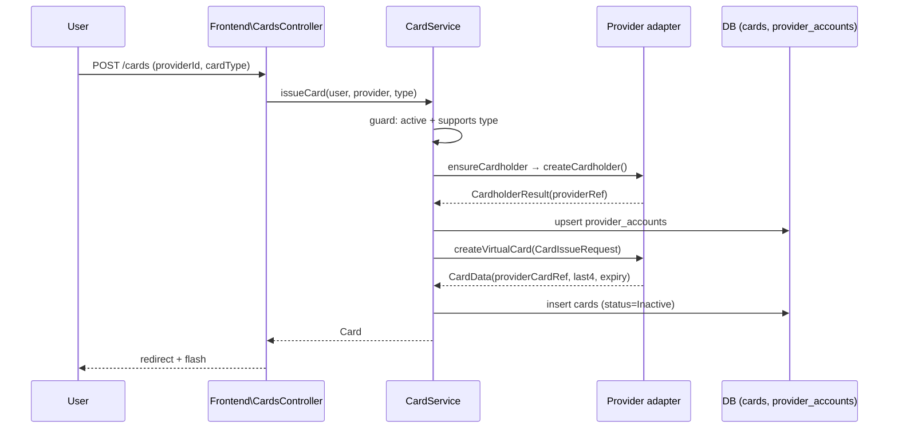
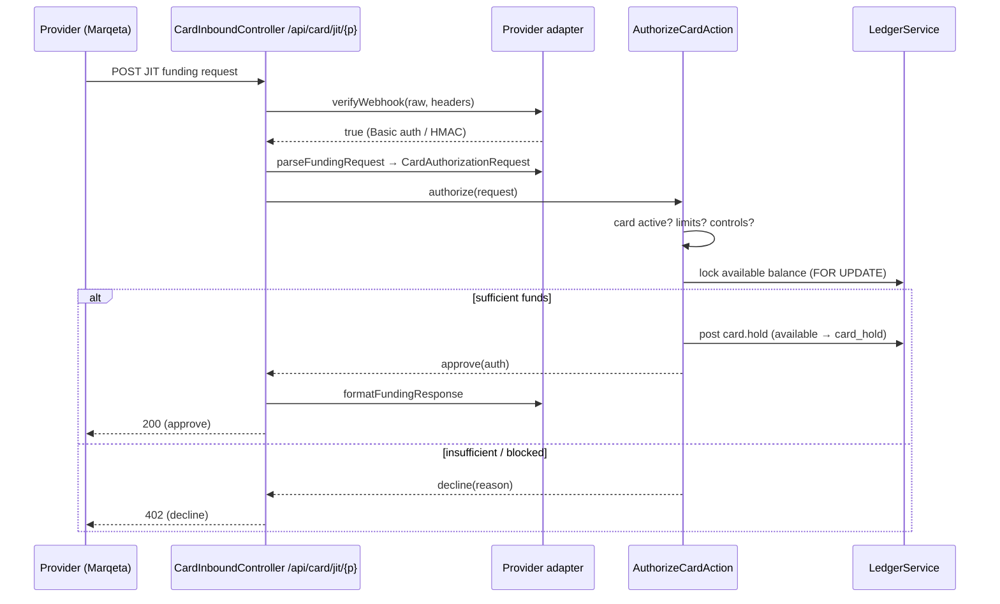
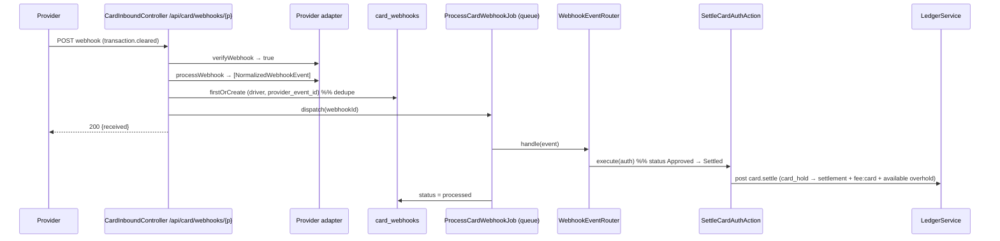

# Flows & Sequence Diagrams

## 1. Card issuance



## 2. Authorization — Gateway JIT (ledger is source of truth)



## 3. Clearing / settlement — async webhook



## 4. Refund & reversal

```mermaid
sequenceDiagram
    participant R as WebhookEventRouter
    participant REF as RefundCardAuthAction
    participant REV as ReverseCardAuthAction
    participant L as LedgerService

    alt transaction.refunded (auth Settled)
        R->>REF: execute(auth)
        REF->>L: post card.refund (settlement → available); status → Reversed on full
    else transaction.reversed (auth Approved, pre-settle)
        R->>REV: execute(auth)
        REV->>L: post card.reverse (card_hold → available); status → Reversed
    end
```

## 5. Wallet integration (money movement)

```
Authorization ──▶ HOLD    : user:available  →  user:card_hold
Settlement    ──▶ CAPTURE : user:card_hold  →  card_program:settlement (+ fee:card, + user:available overhold)
Refund        ──▶ CREDIT  : card_program:settlement → user:available
Reversal      ──▶ RELEASE : user:card_hold  →  user:available
Chargeback(lost) ─▶ LOSS  : card_program:loss → user:available
```

Every leg is a balanced double-entry posting via `LedgerService::post` with an
idempotency key. The provider never holds the balance — it only asks (JIT) or
notifies (webhooks).

## 6. Event flow (webhook → outcome)

| Canonical `WebhookEventType` | Router action | Ledger effect |
|------------------------------|---------------|---------------|
| `transaction.authorized` | `AuthorizeCardAction` (non-JIT only) | hold |
| `transaction.cleared` | `SettleCardAuthAction` | capture |
| `transaction.refunded` | `RefundCardAuthAction` | credit |
| `transaction.reversed` | `ReverseCardAuthAction` | release |
| `card.frozen/unfrozen/closed` | mirror local `Card.status` | none |
| others / unknown | ignored (recorded) | none |

Domain events (`card.generated`, `card.frozen`, `card.settled`, `card.refunded`,
`card.reversed`, …) are written to the audit log via `ActivityLogger`.
