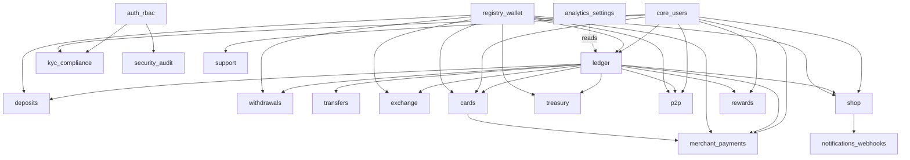
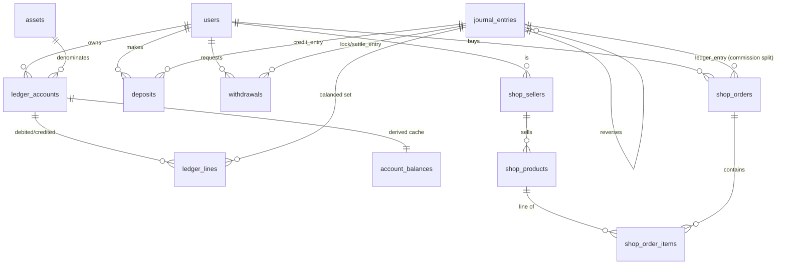

# PoisaPay database — optimization & audit record

PostgreSQL, ~109 application tables across 21 domain modules, single immutable
double-entry ledger. Migrations are the source of truth; a generated modular
snapshot lives in `database/schema/`.

## What was applied (validated: 856 tests green on an isolated DB)

| Pass | Change | Count |
|------|--------|-------|
| Indexes | Supporting B-tree on every foreign key lacking a leading index — PostgreSQL does **not** auto-index FKs, which hurts joins, lookups, and parent UPDATE/DELETE lock contention | **103** |
| Types | `json` → `jsonb` on every JSON column (binary storage, GIN-indexable, faster containment/`->>`) | **31** |
| Integrity | Real foreign keys added for columns that shipped as bare uuids (self-refs, admin/ledger/user references), all `ON DELETE SET NULL` | **11** |
| — | Two polymorphic actor columns (`shop_messages.author_id`, `shop_refund_requests.resolver_id`) kept **index-only** after test data proved a single FK target wrong | 2 |

All of the above are **merged inline into the create-migrations** — each table's
migration fully describes its final shape; there are no trailing patch files.

### Post-change audit (fresh build)
- **232** foreign keys, **0** unindexed · **0** duplicate indexes · **0** tables without a primary key · **0** `json` columns remaining.

## Audit method & a gotcha worth keeping

The schema was audited by introspecting the live migrated database
(`pg_catalog` / `information_schema`) rather than reading 61 migration files.

⚠ **Test-suite isolation:** `php artisan test` uses `RefreshDatabase` on the
shared `poisapay_test` DB. Any *second* process touching that DB mid-run — an
editor's "run tests on save", or a stray `psql` during `migrate:fresh` — causes
`40P01` deadlocks and `relation does not exist` cascades that look like schema
bugs but aren't. Validate DB changes against a **dedicated** database with a
config kept *outside* the workspace (so editor test-runners can't discover it):

```bash
DB_DATABASE=poisapay_iso php artisan migrate:fresh
./vendor/bin/pest -c /path/outside/repo/phpunit.iso.xml   # faithful copy of phpunit.xml, incl. BROADCAST_CONNECTION=null
```

## Module dependency graph



## Core-entity ERD (money spine + commerce)



Per-module table lists and full column/index/FK detail: `database/schema/*.sql`.

## Naming conventions (observed & enforced)
- snake_case tables (plural) and columns; module tables carry a domain prefix (`shop_*`, `p2p_*`, `card_*`).
- PK `id uuid` (app-generated). FK columns `<entity>_id`; actor columns `<verb>_by`.
- Money as integer smallest-units (`*_amount` `bigint`), never float; ledger is authoritative, balances derived.
- Index names Laravel-conventional (`<table>_<col>_index`, `<table>_<cols>_unique`); a few hand-named (`ix_*`, `uq_*`).
- Auto-index names: `<table>_<col>_foreign` (FK), `<table>_<col>_index`.

---

# Recommended next steps (ready-to-apply, not yet applied)

These are lower-value / higher-risk than the indexing+FK pass and are best
reviewed before shipping. Each is a real migration; none require data changes
(no production data yet).

### 1. BRIN indexes on append-only, time-ordered tables
Tiny indexes ideal for range scans on monotonically-growing `created_at`:
```sql
CREATE INDEX journal_entries_created_at_brin   ON journal_entries   USING brin (created_at);
CREATE INDEX ledger_lines_created_at_brin      ON ledger_lines      USING brin (created_at);
CREATE INDEX audit_logs_created_at_brin        ON audit_logs        USING brin (created_at);
CREATE INDEX security_events_created_at_brin   ON security_events   USING brin (created_at);
CREATE INDEX shop_analytics_events_created_brin ON shop_analytics_events USING brin (created_at);
CREATE INDEX webhook_deliveries_created_at_brin ON webhook_deliveries USING brin (created_at);
CREATE INDEX onchain_txs_created_at_brin       ON onchain_txs       USING brin (created_at);
```

### 2. CHECK constraints (data-integrity at the DB)
Apply conservatively — verify each against the suite (money in the ledger is
signed, so do **not** blanket non-negative amounts):
```sql
ALTER TABLE shop_order_items    ADD CONSTRAINT chk_qty_pos   CHECK (quantity > 0);
ALTER TABLE shop_products       ADD CONSTRAINT chk_price_nn  CHECK (price_amount >= 0);
ALTER TABLE shop_orders         ADD CONSTRAINT chk_total_nn  CHECK (total_amount >= 0 AND commission_amount >= 0);
ALTER TABLE shop_sellers        ADD CONSTRAINT chk_bps_range CHECK (commission_bps BETWEEN 0 AND 10000);
ALTER TABLE account_balances    ADD CONSTRAINT chk_version_nn CHECK (version >= 0);
```

### 3. Range partitioning for the highest-volume tables (at scale)
`ledger_lines`, `journal_entries`, `audit_logs`, `shop_analytics_events` are the
growth drivers. Partition by month on `created_at` (declarative partitioning;
FKs into partitioned tables are supported in PG12+). Roll out behind a
maintenance window with `pg_partman` or a monthly `CREATE TABLE ... PARTITION OF`.

### 4. Generated columns / materialized views
- `account_balances` is already a trigger-maintained derived cache — consider a
  nightly **materialized view** for reporting rollups instead of live SUMs.
- Consider a `GENERATED ALWAYS AS` column for `shop_orders.net = total_amount - commission_amount` if it's read-heavy.

### 5. GIN indexes on searched JSONB (now that columns are `jsonb`)
Add only where a JSON path is actually filtered, e.g.:
```sql
CREATE INDEX p2p_ads_countries_gin ON p2p_ads USING gin (countries);
```
