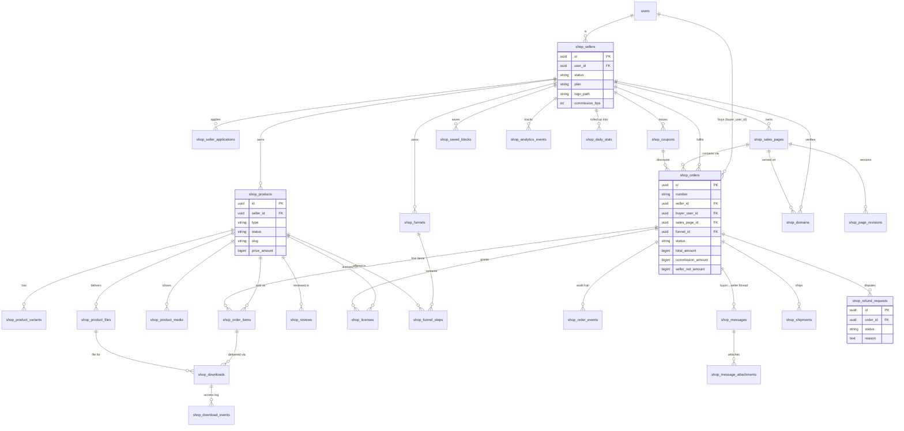

# Shop module — Entity Relationship Diagram

Post-migration schema (all tables `shop_*`). The seller entity keeps the name
**seller** (`shop_sellers`) — CLAUDE.md reserves *Merchant* for the financial
core (`app/Domain/Merchant`). Buyers are core `users`.

### Table inventory (26)
`shop_sellers`, `shop_seller_applications`, `shop_products`, `shop_product_variants`,
`shop_product_files`, `shop_product_media`, `shop_sales_pages`, `shop_page_revisions`,
`shop_saved_blocks`, `shop_domains`, `shop_funnels`, `shop_funnel_steps`, `shop_orders`,
`shop_order_items`, `shop_order_events`, `shop_coupons`, `shop_downloads`,
`shop_download_events`, `shop_licenses`, `shop_reviews`, `shop_messages`,
`shop_message_attachments`, `shop_shipments`, `shop_refund_requests`,
`shop_analytics_events`, `shop_daily_stats`.

### Ledger touchpoint
Shop commission revenue posts to `LedgerAccountType::ShopCommissionIncome`
(backing value `shop:commission_income`). Money never bypasses the ledger; the
seller's net is held then released per the `shop_earnings_hold` flag.
